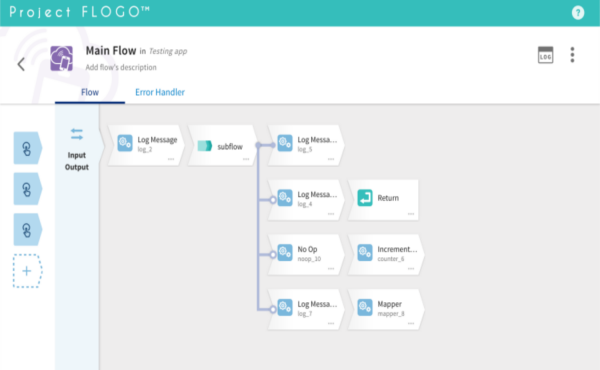

# Flogo Web UI

[](https://hub.docker.com/r/flogo/flogo-docker/)
[](https://travis-ci.com/project-flogo/flogo-web)
[](./LICENSE)
[](https://gitter.im/project-flogo/Lobby)

Web-based design tool for the [Project Flogo](https://github.com/TIBCOSoftware/flogo) open source framework.



## Using the Web UI

The easiest way to get started with the Flogo Web UI is via the official [Docker image](https://hub.docker.com/r/flogo/flogo-docker).
The Docker image is available in [Docker Hub](https://hub.docker.com/r/flogo/flogo-docker) and it contains the Flogo Web UI
along with all required components to begin developing, testing and building deployable artifacts right from your web browser.

You can find a more complete start guide for the official Docker image in the [Project Flogo documentation](https://tibcosoftware.github.io/flogo/getting-started/getting-started-webui).

## Issues, Bug Reports and Feature Requests

Check out our [issue tracker](https://github.com/project-flogo/flogo-web/issues).

If you have any questions, feel free to post an issue and tag it as a question, email flogo-oss@tibco.com or chat with the team and community:

- The [project-flogo/Lobby](https://gitter.im/project-flogo/Lobby) Gitter channel should be used for general discussions, start here for all things Flogo!
- The [project-flogo/developers](https://gitter.im/project-flogo/developers) Gitter channel should be used for developer/contributor focused conversations.

## Development

The recommended method is to [run the app locally](#run-locally) which is going to be easier for debugging as well as it is
going to watch for code changes and reload automatically, alternatively you can [build your own docker image](#building-and-running-the-development-docker-image).

### Run locally

Before starting make sure you have the following installed in your machine:

- git
- Latest [Flogo CLI (flogo-cli)](https://github.com/project-flogo/cli)
- As part of the Flogo CLI installation process you should've also installed the Go programming language. Make sure
  you added `$GOPATH/bin` to your `$PATH` variable. Instructions can be found in [Go's installation docs](https://golang.org/doc/install)
- [Docker and docker-compose](https://www.docker.com) 17.12.0 or greater
- [NodeJS 10.14 or greater](https://nodejs.org/en/download/releases/)
- [yarn v1.9.4 or greater](https://yarnpkg.com)

Let's bootstrap the project, in a terminal run the following:

```bash
# Get the Flogo Web UI source from GitHub
git clone https://github.com/project-flogo/flogo-web.git

# Go to the directory
cd flogo-web

# Install the javascript dependencies
yarn install
```

From here we're going to need two terminals, one to run the server application and another one for the client app:

```bash
# in terminal 1 run:
yarn start server

# in terminal 2 run:
yarn start client
```

> :coffee: Please be patient if this is the first time you run the server app as it can take several minutes to finish the
> startup process because the server app will need to create a Flogo engine instance and install the default activities and triggers.

Once both applications finish their startup process open [http://localhost:4200](http://localhost:4200) to start using the Flogo Web UI!

<details><summary>Example of server output</summary>

```

 ======================================================
                 ___       __   __   __ TM
                |__  |    /  \ / _` /  \
                |    |___ \__/ \__| \__/

   [success] open http://localhost:3303 in your browser
  ======================================================
```

</details>

<details><summary>Example of client output</summary>

```

❯ yarn start client
yarn run v1.9.4
$ ng serve client
** Angular Live Development Server is listening on localhost:4200, open your browser on http://localhost:4200/ **
                                                           s Date: 2019-04-01T22:09:22.196Z
Hash: 4ef21db4aa063e7aa9a9
Time: 22777ms
chunk {app-app-module} app-app-module.js, app-app-module.js.map (app-app-module) 370 kB  [rendered]
chunk {config-config-module} config-config-module.js, config-config-module.js.map (config-config-module) 16.2 kB  [rendered]
chunk {flogo-web-plugins-flow-client} flogo-web-plugins-flow-client.js, flogo-web-plugins-flow-client.js.map (flogo-web-plugins-flow-client) 1.58 MB  [rendered]
chunk {home-home-module} home-home-module.j
```

</details>

### Building and running the development docker image

Before starting make sure you have Docker installed and then from a terminal run:

```bash
# Get the Flogo Web UI source from GitHub
git clone https://github.com/project-flogo/flogo-web.git

# Go to the directory
cd flogo-web

# Build the docker image
# Note that depending on your machine resources this might take several minutes
docker build -f tools/docker/dev.Dockerfile -t flogo/flogo-web:dev-build .

# Start the container
docker run -it -p 5033:3303 flogo/flogo-web:dev-build

```

You can navigate to `http://localhost:5033` once the container starts. Note that you can change
the port `5033` in the command to a different port if needed.

## More docs?

[Available in /docs](./docs)

<!-- ## Contributing -->

## License

The flogo-web repo is licensed under a BSD-style license. Refer to [LICENSE](./LICENSE) for license text.
