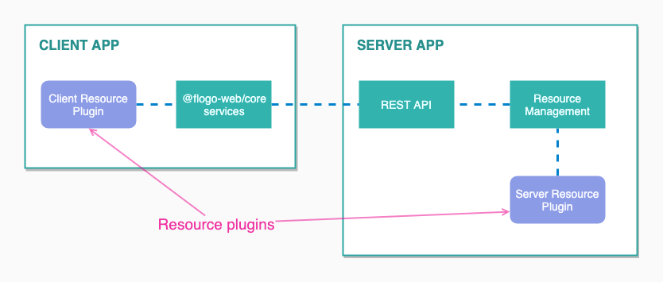
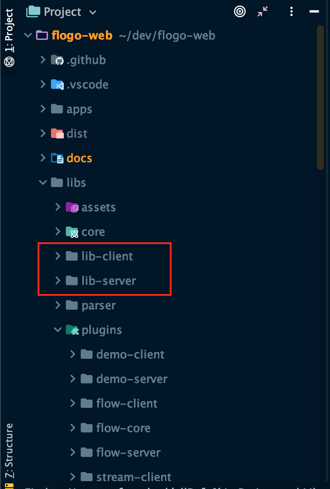
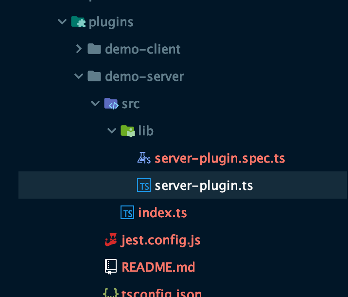
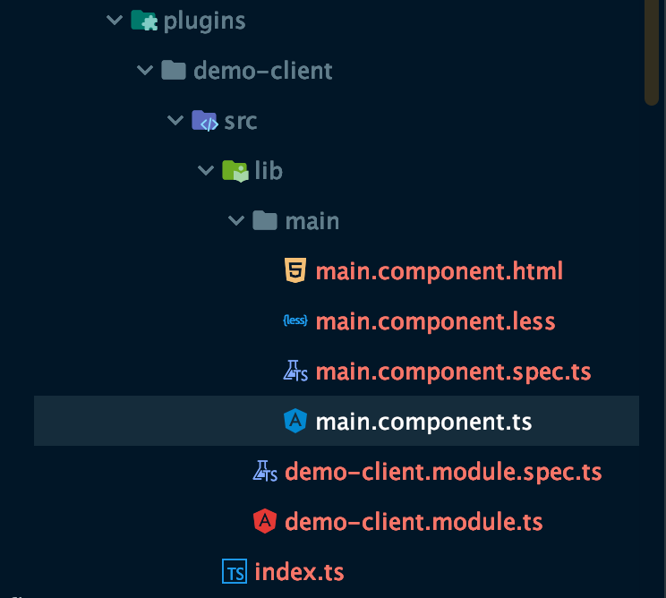
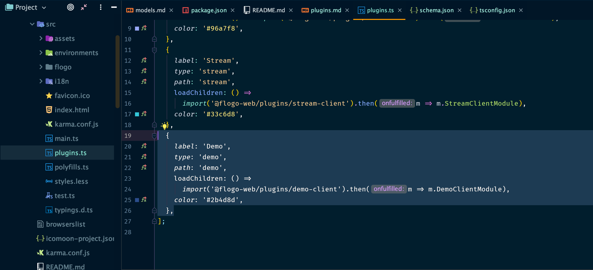
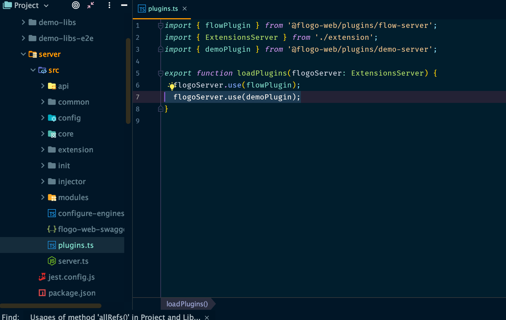
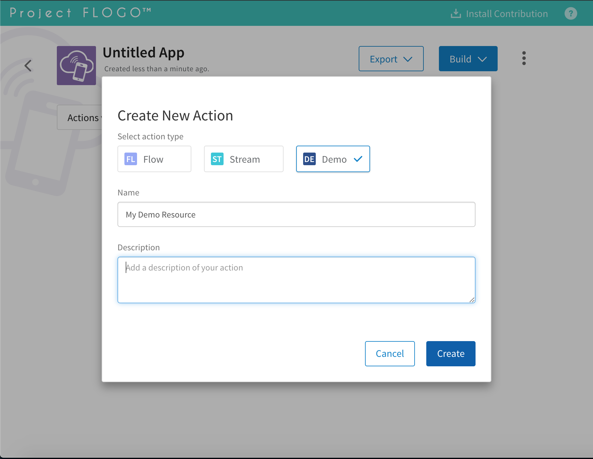
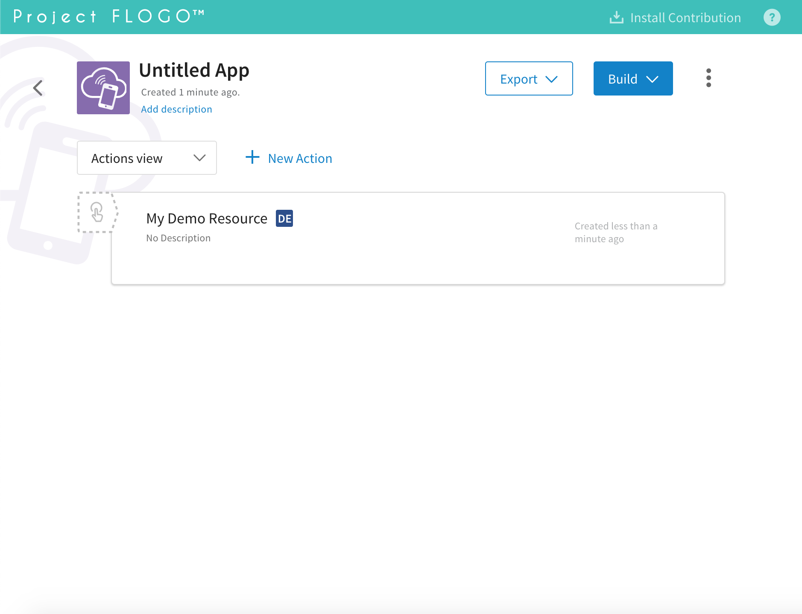
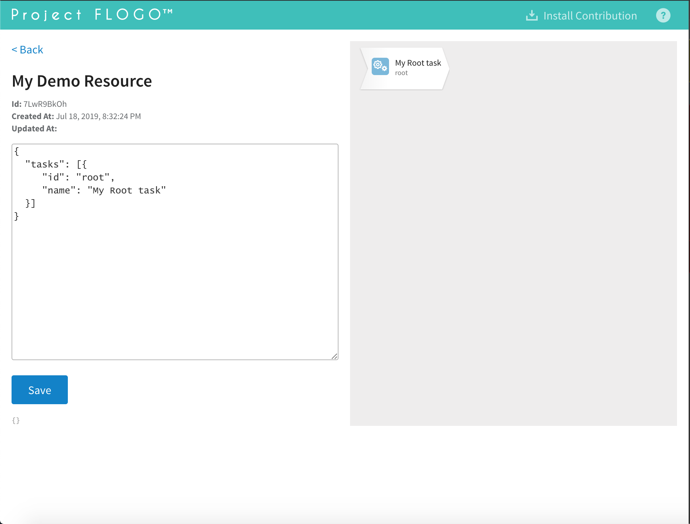

# Plugins

- [Plugins](#plugins)
  - [Note About The Tooling](#note-about-the-tooling)
  - [Location and Naming Conventions](#location-and-naming-conventions)
  - [Generating Plugins](#generating-plugins)
  - [Example: Create a Demo Resource](#example--create-a-demo-resource)
  - [Client Plugins](#client-plugins)
    - [API](#api)
  - [Server Plugins](#server-plugins)
    - [The Development ref Placeholder](#the-development-ref-placeholder)
    - [API](#api-1)

The Flogo Web project implements a plugin based architecture to allow easier extensibility and integration of new types
of Flogo Resources. Flogo Resources are also referred as Action Types.

> :information_source: Check [Project Flogo's documentation](https://github.com/TIBCOSoftware/flogo) for more information about handlers, resources and actions.

Two types of plugins are need for each type of resource:

- **Client plugin:** An Angular library that provides the designer UI for a type of resource. This plugin will be loaded by the client app.
- **Server plugin:** Registers a resource type server side and instructs how to import and export that type of resource.
  It optionally registers resource hooks to tap into resource events such as creation and update.



## Note About The Tooling

The Flogo Web project plugin setup relies heavily on the [Angular CLI](https://cli.angular.io/) and [Nrwl's Nx](https://github.com/nrwl/nx) tools.
Being familiar with those tools is not necessary to start contribution to the project but it will be helpful to navigate the structure.

## Location and Naming Conventions

Plugins are located in `libs/plugins` and the naming convention is as following:

- `<resourceType>-client`: for the client plugins. For example `flow-client`.
- `<resourceType>-server`: for the server plugins. For example `flow-server`.
- `<resourceType>-core`: optionally for code to be shared between client and server plugins for a given resource type.
  For example `flow-core`.

## Generating Plugins

Flogo Web provides a command line utility to automatically scaffold a new type resource. The utility will initialize both the client and
server plugins for your resource type as well as register them in the corresponding client and server apps.

To create a new type you will require:

1. Type: The type of your resource, for example 'flow'. This will be used as the identifier for this type of resource in the application.
2. Ref: The ref identifier for the corresponding Flogo Resource Contribution implementation. For example for flows it is `github.com/project-flogo/flow`.
   The ref will be used to install the contribution into the underlying engine and for importing, exporting and building/compiling this type of resource. You
   can omit the ref if you don't have one yet. If the ref is omitted a special ref for development purposes will be automatically assigned and used as placeholder
   Once
   you have the actual ref you can replace it the server plugin's code. Check the server plugin section in this document for more information.

To start the resource generator run the following and follow the interactive prompts:

```bash
yarn flogo:new-resource
```

Alternatively pass all the parameters and skip the interactive prompt (omit ref if you want to use the special ref placeholder):

```
yarn flogo:new-resource --type="demo" --ref="github.com/my/demo" --no-interactive
```

## Example: Create a Demo Resource

This section is a quick tutorial of how to register a new resource of type 'demo' in the Flogo Web project.

**1. Run the resource generator**

Open a terminal in the project root and run:

```
yarn flogo:new-resource --type=demo --no-interactive
```

Once the command is finished we can start the server and client and start playing with the new resource type. But before we go into that
let's look at the structure that the utility generated.

**2. Generated structure**

After the command is finished you should see that a `demo-client` and `demo-server` plugins have been added to the `lib/plugins` folder.



The server plugin's main file contains an implementation of a server plugin that can be used as base for further customization:



The client plugin pre-configures an provides a sample main Angular component that exemplifies the interaction with the server
app throught Flogo Web Client's core services:



Besides the structure generated under `libs/plugins` the command line utility also updated the configuration files to register the new type of resource.
Among the most relevant configuration files are:

- Client's plugin registration (`apps/client/src/plugins.ts`). This configures a route to load the plugin's module into the client app and registers it
  in the app. You can customize the label and the color used to identify the type of resource in the Web UI.



- Server's plugin registration (`apps/server/src/plugins.ts`). Instantiates and registers the plugins into the server app.



**2. Start the dev environment and use the newly created resource type**

1. Start the server and client app in dev mode running `yarn start server` and `yarn start client` in separate terminals (more info in the [main README](../README.md#run-locally))
2. Once the server and client app are running open the client app in your browser navigating to `http://localhost:4200`.
3. Create a new app and open the app
4. Click on "New Action"
5. You should be able to see a new option for the "Demo" resource we just created. Select it and give a name to your action and hit on Create.
   
6. Click on the resource we just created
   
7. The sample designer for the demo resource should be loaded on the screen. You can add more tasks/links to the demo on the left
   and save your changes. This sample designer uses the core client services and the common diagram component.
   

## Client Plugins

Client plugins are Angular libraries that implement the designer UI for a type of resource.

The client plugin communicates with the server through a set of services provided by the Flogo Web Client app. It can uses
the services to fetch and update existing resources and their corresponding handlers.

### API

TBA

## Server Plugins

Registers a resource type with the server app and instructs how to import and export that type of resource.
It optionally registers resource hooks to tap into resource events such as creation and update.

### The Development ref Placeholder

During the iitial development of a new resource type instead of using a ref of an actual Flogo contribution
you can use the special `__DEV_RESOURCE_REF_PLACEHOLDER` available in the core package (`@flogo-web/core`).

This placeholder ref has a special meaning for the server app and when used it will skip the installation of the contribution
in the underlying engine. Note that using the placeholder ref will allow you to design resources through the Web UI but it will break features
that require interaction with the underlying Flogo Engine such as compiling/building a Flogo App.

Example:

```typescript
import { __DEV_RESOURCE_REF_PLACEHOLDER } from '@flogo-web/core';
```

### API

TBA
